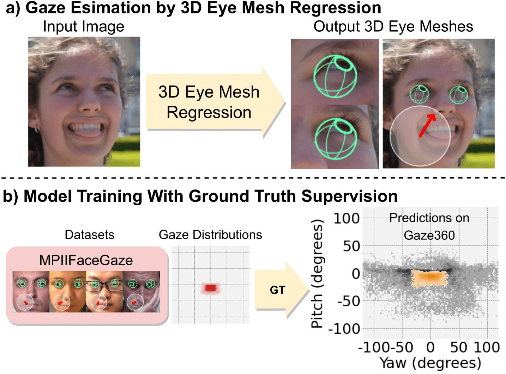

# 3DGazeNet

Official implementation of the paper ***3DGazeNet: Generalizing Gaze Estimation with Weak-Supervision from Synthetic Views ([arxiv](https://arxiv.org/abs/2212.02997))***

<p align="center">
  
  
</p>

https://github.com/Vagver/dense3Deyes/assets/25174551/4de4fb76-9577-4209-ba07-779356230131

## Installation

To create a conda environment with the required dependences run the command: 

```
$ conda env create --file env_requirements.yaml
$ conda activate 3DGazeNet
```

## Download models

Download the data directory contatining pre-trained gaze estimation models from [here](https://drive.google.com/file/d/1mYvKRJGS8LY5IU3I8Qfvm-xINQyby1z5/view?usp=sharing). Extract and place the data folder in the root directory of this repo.

## Inference

To run inference on a set of images follow the steps below. A set of example images are given in the `data/example_images` directory.

1\. Pre-process the set of images. This step performs face detection and exports a `.pkl` file in the path defined by `--output_dir`, containing pre-processing data. For data pre-processing run the following command:

```
$ cd tools
$ python preprocess_inference.py --image_base_dir ../data/example_images 
                                 --output_dir ../output/preprocessing
                                 --gpu_id 0 --n_procs 5
```

2\. Run inference on the set of images. This step outputs gaze estimation and 3D eye reconstruction results in a `.pkl` file in the `inference_results` directory. For inference run the following command:

```
$ python inference.py --cfg configs/inference/inference.yaml
                      --inference_data_file 'output/preprocessing/data_face68.pkl'
                      --inference_dataset_dir 'data/example_images/'
                      --checkpoint data/3dgazenet/models/singleview/vertex/ALL/test_0/checkpoint.pth
                      --skip_optimizer
```

3\. To inspect the gaze tracking results run the jupyter notebook in `notebooks/view-inference_results.ipynb`.

Bash scripts for the above commands can be found in the `scripts` directory.

## Prepare Datasets 

### ETH-XGaze
1\. Download the 448*448 pixels version of the datset from the official source [here](https://ait.ethz.ch/xgaze). Place the dataset in the `datasets` folder in the root of this repo.

2\. Fit 3D eyes on images using the following command. This will export a `.pkl` data file in the dataset's folder which is used for training.
```
cd tools
python xgaze_preprocess.py
```

3\. To visualize the 3D eye fittings run the notebook in `notebooks/xgaze_view_dataset.ipynb`.

### Gaze360

1\. Download the datset from the official source [here](http://gaze360.csail.mit.edu/). Place the dataset in the `datasets` folder in the root of this repo.

2\. Fit 3D eyes on images using the following command. This will export a `.pkl` data file in the dataset's folder which is used for training.
```
cd tools
python gaze360_preprocess.py
```

3\. To visualize the 3D eye fittings run the notebook in `notebooks/gaze360_view_dataset.ipynb`.

### GazeCapture

1\. Download the datset from the official source [here](https://gazecapture.csail.mit.edu/). Place the dataset in the `datasets` folder in the root of this repo.

### MPIIFaceGaze

1\. Download the aligned dataset from the official source [here](https://www.perceptualui.org/research/datasets/MPIIFaceGaze/). Place the dataset in the `datasets` folder in the root of this repo.

2\. Fit 3D eyes on images using the following command. This will export a `.pkl` data file in the dataset's folder which is used for training.
```
cd tools
python mpiiface_preprocess.py
```

3\. To visualize the 3D eye fittings run the notebook in `notebooks/mpiiface_view_dataset.ipynb`.


